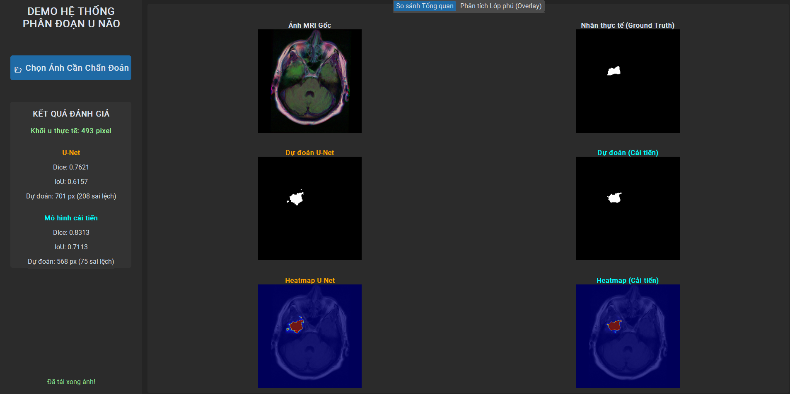

**Ngôn ngữ:** Tiếng Việt *



[](LICENSE)


> [!WARNING]
> **Khuyến nghị phần cứng:** Quá trình huấn luyện mô hình đòi hỏi lượng tài nguyên tính toán lớn. Nên chạy mô hình trên các máy có Card đồ họa rời (NVIDIA) có hỗ trợ CUDA. Để chạy Giao diện Demo, CPU hoặc GPU thông thường đều có thể đáp ứng được.

**3.929 ảnh MRI** | **Tích hợp Attention Gate** | **Vision Transformer Bottleneck** | **Dice Score: 0.8588**

---

<div align="center">

**HỆ THỐNG TRỢ LÝ CHẨN ĐOÁN THỨ HAI (SECOND OPINION) CHO BÁC SĨ HÌNH ẢNH**

Mô hình không sử dụng các bản nháp có sẵn mà tiến hành thiết kế và tinh chỉnh lại toàn bộ đáy mạng bằng kiến trúc ViT, kết hợp cơ chế Attention Gate ở các luồng giải mã nhằm triệt tiêu điểm mù cục bộ và tăng độ chính xác trong y tế lâm sàng.

</div>

---

## 🚀 Tính Năng Mới (Mô Hình Đề Xuất)

- **Khắc phục điểm mù (Vision Transformer Bottleneck)**: Thay thế khối CNN đáy mạng bằng ViT, cho phép mô hình nhìn nhận toàn cục cấu trúc não bộ, triệt tiêu phân đoạn nhầm vân não thành khối u.
- **Chặn nhiễu truyền dẫn (Attention Gate)**: Đóng vai trò như màng lọc thông minh, lọc bỏ các thông tin rác (màng não, hộp sọ) trước khi đưa vào luồng giải mã.
- **Chống mất cân bằng (DiceBCELoss + Pos_Weight)**: Xử lý triệt để hiện tượng mất cân bằng lớp (Class Imbalance) thường gặp trong y tế, ép mô hình phát hiện cả những khối u siêu nhỏ (dưới 1% bức ảnh).

---

## 📖 Hướng Dẫn Nhanh (Quick Start)

Vui lòng tham khảo chi tiết tại **[HƯỚNG DẪN SỬ DỤNG VÀ CHẠY DEMO](docs/HUONG_DAN_SU_DUNG.md)**.

### Dữ Liệu (Dataset)
Để chạy thử nghiệm phần mềm nhanh chóng, có thể tải bản **Demo Dataset** gọn nhẹ tại đây:
**[Tải Demo Dataset (Google Drive)](https://drive.google.com/file/d/1_3b3xIKiLMhceV-CPqMow5AUCyy8fMGU/view?usp=sharing)**
*(Lưu ý: Sau khi tải về, giải nén và đặt toàn bộ thư mục vào đường dẫn `src/archive/demo_data`)*

Ngoài ra, nếu muốn huấn luyện lại mô hình,có thể tải bộ dữ liệu gốc đầy đủ từ Kaggle:
**[LGG MRI Segmentation Dataset (Kaggle)](https://www.kaggle.com/datasets/mateuszbuda/lgg-mri-segmentation)**

### Yêu Cầu Cài Đặt (Prerequisites)
- Python 3.9+
- Khuyến nghị card đồ họa NVIDIA (CUDA 11.8+)

### Bước 1: Cài đặt thư viện

```bash
# Clone mã nguồn
git clone https://github.com/Anchinlu/tn-da22tta-huynhphamnhatan-phandoankhoiunao.git
cd tn-da22tta-huynhphamnhatan-phandoankhoiunao/src

# Cài đặt thư viện
pip install torch torchvision
pip install numpy matplotlib pillow customtkinter scikit-learn
```

### Bước 2: Chạy Demo

Để khởi chạy giao diện GUI so sánh giữa U-Net và TransUNet:
```bash
python demo_app.py
```

### Bước 3: Huấn luyện lại từ đầu (Training)

```bash
python train.py
```
*(Chi tiết thông số huấn luyện được cấu hình tại `src/configs/config.py`)*

---

## 📂 Cấu Trúc Dự Án (What's Inside)

Toàn bộ hệ thống được chia làm hai phân vùng riêng biệt:

```text
tn-da22tta-huynhphamnhatan-phandoankhoiunao/
|-- docs/                 # Báo cáo, Slide bảo vệ, Poster, Hướng dẫn sử dụng
|   |-- HUONG_DAN_SU_DUNG.md
|   |-- BaoCaoTrinhBay_Fix.docx
|   |-- BaoCaoTrinhBay_Fix.pdf
|
|-- src/                  # Toàn bộ mã nguồn dự án (Codebase)
|   |-- archive/          # Dữ liệu hình ảnh Kaggle gốc và ảnh chạy Demo
|   |-- configs/          # Các file cấu hình tham số (config.py)
|   |-- data/             # Tiền xử lý dữ liệu (dataset.py)
|   |-- networks/         # Định nghĩa kiến trúc (unet.py, transunet.py)
|   |-- Transunet/        # Trọng số (.pth) và file log huấn luyện của Transunet
|   |-- Unet/             # Trọng số (.pth) và file log huấn luyện của Unet
|   |-- demo_app.py       # Ứng dụng Giao diện người dùng
|   |-- train.py          # Script huấn luyện mô hình chính
|   |-- utils/            # Các hàm hỗ trợ tính toán Loss và Dice
|
|-- README.md             # Tài liệu này
|-- .gitignore            # Loại trừ bộ nhớ đệm
```

---

<div align="center">
<sub>Đồ án tốt nghiệp hoàn thành tháng 06/2026.</sub>
</div>
