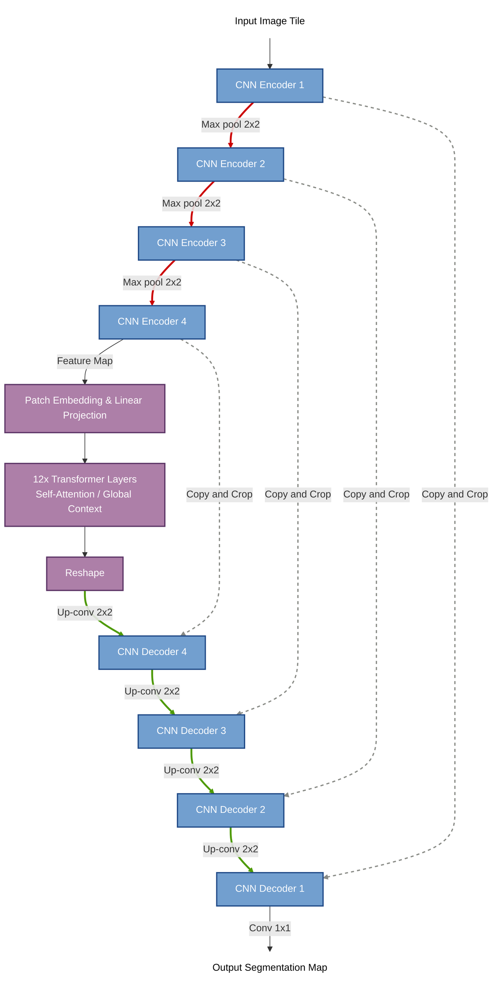

# BÁO CÁO TIẾN ĐỘ ĐỒ ÁN TỐT NGHIỆP
**Chủ đề:** Phân vùng U não trên ảnh MRI
**Trọng tâm:** Kiến trúc U-Net gốc, Các đóng góp cụ thể thông qua cải tiến TransUNet và Đánh giá thực nghiệm.

---

## I. Phân tích nguyên lý và Giới hạn của U-Net gốc

Theo đúng định hướng *"Cần hiểu được U-Net hoạt động như thế nào trước khi cải tiến"*, nhóm đã nghiên cứu sâu vào kiến trúc cốt lõi của mạng U-Net và xác định được giới hạn thuật toán của nó.

### 1. Kiến trúc mạng U-Net
U-Net là kiến trúc kinh điển trong phân vùng ảnh y tế, được thiết kế hoàn toàn dựa trên Mạng nơ-ron tích chập (CNN). 
- **Cơ chế luồng dữ liệu:** Bao gồm dải mã hóa (Encoder) để trích xuất đặc trưng và dải giải mã (Decoder) để khôi phục ảnh. 
- **Đặc trưng nổi bật:** Các kết nối tắt (Skip Connections) trực tiếp truyền thông tin vị trí từ Encoder sang Decoder, giúp mạng không bị mất cấu trúc không gian khi khôi phục ảnh.

```mermaid
graph TD
    %% Khai báo màu sắc giống sơ đồ gốc
    classDef blueBox fill:#729fcf,stroke:#204a87,stroke-width:2px,color:#fff;
    classDef textOnly fill:none,stroke:none,color:#000;
    
    In[Input Image Tile]:::textOnly --> E1[Encoder Block 1]:::blueBox
    
    E1 -- Max pool 2x2 --> E2[Encoder Block 2]:::blueBox
    E2 -- Max pool 2x2 --> E3[Encoder Block 3]:::blueBox
    E3 -- Max pool 2x2 --> E4[Encoder Block 4]:::blueBox
    E4 -- Max pool 2x2 --> B[Bottleneck]:::blueBox
    
    B -- Up-conv 2x2 --> D4[Decoder Block 4]:::blueBox
    D4 -- Up-conv 2x2 --> D3[Decoder Block 3]:::blueBox
    D3 -- Up-conv 2x2 --> D2[Decoder Block 2]:::blueBox
    D2 -- Up-conv 2x2 --> D1[Decoder Block 1]:::blueBox
    
    D1 -- Conv 1x1 --> Out[Output Segmentation Map]:::textOnly
    
    %% Skip Connections
    E4 -. Copy and Crop .-> D4
    E3 -. Copy and Crop .-> D3
    E2 -. Copy and Crop .-> D2
    E1 -. Copy and Crop .-> D1
    
    %% Đổi màu các đường line giống ảnh gốc
    linkStyle 1,2,3,4 stroke:#cc0000,stroke-width:3px; %% Mũi tên Đỏ (Max pool)
    linkStyle 5,6,7,8 stroke:#4e9a06,stroke-width:3px; %% Mũi tên Xanh lá (Up-conv)
    linkStyle 10,11,12,13 stroke:#888a85,stroke-width:2px,stroke-dasharray: 5 5; %% Mũi tên Xám (Copy and Crop)
    linkStyle 9 stroke:#008080,stroke-width:3px; %% Mũi tên Xanh mòng két (Conv 1x1)
```

> **💡 Gợi ý Prompt tạo ảnh minh họa (DALL-E/Midjourney):**
> *"A classic technical academic diagram of a U-Net neural network. Flat vector illustration on a pure white background. The architecture is shaped like a symmetrical 'U' made of vertical blue rectangular boxes of varying heights. The left side (encoder) steps down with red downward arrows, the right side (decoder) steps up with green upward arrows. Long horizontal gray arrows (skip connections) connect the left side boxes directly to the right side boxes. Clean, crisp, textbook diagram style, no 3D effects, no glowing, purely functional scientific technical drawing."*

### 2. Điểm yếu chí mạng của U-Net (Giới hạn của CNN)
Bản chất của các phép toán tích chập (Convolution) trong U-Net là chúng chỉ có **trường nhìn cục bộ (Local Receptive Field)**. 
- Khi trượt bộ lọc (kernel) qua ảnh, mô hình chỉ nhìn thấy một khu vực lân cận rất nhỏ. Nó hoàn toàn thiếu đi "bức tranh tổng thể" (Global Context).
- Đối với ảnh MRI u não, ranh giới khối u thường rất mờ nhạt và phức tạp. Việc thiếu tầm nhìn bao quát khiến U-Net bị hạn chế trong việc nhận diện đúng ranh giới, thường dẫn đến hiện tượng chẩn đoán lố (Over-segmentation) hoặc nhận diện sai các vùng có vân não giống khối u.

---

## II. Các đóng góp cụ thể thông qua cải tiến (TransUNet)

Nhận diện được giới hạn cục bộ của U-Net, nhóm đồ án đã nghiên cứu và đưa ra các đóng góp cụ thể bằng cách tích hợp Vision Transformer vào kiến trúc (TransUNet). Thay vì giải thích chung chung về Transformer, dưới đây là những điểm cải tiến cụ thể mà nhóm đã thiết kế để giúp U-Net vượt trội hơn:

### Đóng góp 1: Phá vỡ rào cản cục bộ bằng cơ chế Tự chú ý (Self-Attention)
- Nhóm đã đưa khối Vision Transformer vào nút thắt sâu nhất (Bottleneck) của mạng.
- Thay vì quét từng ô nhỏ như CNN, cơ chế Self-Attention tính toán trực tiếp độ tương quan của một điểm ảnh với **tất cả** các điểm ảnh khác trên não bộ cùng một lúc.
- Nhờ vậy, mô hình có được **Ngữ cảnh toàn cục (Global Context)**. Nó hiểu được vị trí tương đối của khối u so với toàn bộ hộp sọ chứ không chỉ dựa vào các vệt sáng cục bộ.



> **💡 Gợi ý Prompt tạo ảnh minh họa (DALL-E/Midjourney):**
> 
> **1. Ảnh kiến trúc mạng TransUNet:**
> *"A technical academic diagram of a TransUNet neural network architecture. It has a standard U-Net shape with left side stepping down and right side stepping up, made of blue rectangular boxes. However, at the very bottom bottleneck, there is a distinct purple block representing a Vision Transformer. White background, flat vector style, clear, minimalistic, and highly professional."*
> 
> **2. Ảnh so sánh Convolution vs Self-Attention:**
> *"A side-by-side technical infographic on a white background. The left side is titled 'Convolution Processing' and shows a localized 3x3 small square sliding over a pixel grid. The right side is titled 'Self-Attention' and shows a single central pixel shooting connecting light rays to every other pixel in the grid. Flat vector style, academic, simple colors."*
> 
> **3. Ảnh minh họa "Grasping Global Context" (Ví dụ ảo ảnh thị giác):**
> *"An infographic demonstrating Global Context in neural networks. It features a side-by-side visual metaphor using an optical illusion. The left side shows a highly zoomed-in crop of the image where it just looks like random textures (representing local CNN view). The right side shows the full image revealing a hidden object, like a face made of landscape elements (representing Transformer global context). Minimalistic, academic textbook style."*

### Đóng góp 2: Tối ưu hóa độ sắc nét của đường ranh giới khối u
- U-Net truyền thống thường tạo ra các đường viền mờ hoặc lởm chởm.
- Bằng cách kết hợp TransUNet, nhóm giữ lại sức mạnh của CNN ở các tầng nông (để trích xuất sắc nét các góc cạnh, vân não) và dùng Transformer ở tầng sâu (để định hướng cấu trúc tổng thể). Sự kết hợp này mang lại đường viền phân vùng mượt mà và bám sát thực tế sinh học hơn.

### Đóng góp 3: Khắc phục triệt để lỗi Over-segmentation (Khoanh vùng lố)
- Với U-Net, khi gặp vùng ảnh mờ, nó có xu hướng "khoanh nhầm còn hơn bỏ sót" do không nắm được tổng thể.
- Nhờ khả năng phân tích toàn cục của Transformer, TransUNet cực kỳ quyết đoán ở vùng ranh giới. Nó biết chính xác nơi nào khối u kết thúc, giúp giảm thiểu tối đa số lượng pixel bị chẩn đoán lố (false positives).

---

## III. Thực nghiệm đánh giá (Chứng minh bằng kết quả)

Để làm rõ giá trị của các đóng góp trên, nhóm đã tiến hành thực nghiệm so sánh Inference giữa U-Net gốc và mô hình cải tiến TransUNet trên cùng một dữ liệu khối u có diện tích thực tế **3,850 pixels**.

### Kết quả so sánh trực quan


1. **Kết quả của U-Net gốc (CNN):** 
   - *Phân tích:* U-Net bắt trúng khối u với diện tích dự đoán là **3,939 pixels**. Mặc dù đây là một kết quả khá tốt, mô hình vẫn không tránh khỏi lỗi chẩn đoán lố ở viền ngoài (dư gần 90 pixel) do bản chất chỉ trích xuất đặc trưng cục bộ.
2. **Kết quả của TransUNet (Mô hình cải tiến):** 
   - *Phân tích:* TransUNet đã phô diễn sự chính xác đáng kinh ngạc với diện tích dự đoán đạt **3,874 pixels** (chỉ lệch đúng 24 pixel so với Ground Truth). Kết quả này gần như hoàn hảo về mặt thị giác. Việc thu hẹp đáng kể phần khoanh lố của U-Net là minh chứng đanh thép cho Đóng góp 1 và Đóng góp 3: Cơ chế tự chú ý (Self-Attention) hoạt động như một hệ thống "nhận thức không gian", giúp mô hình phân định rạch ròi ranh giới u dựa trên ngữ cảnh toàn cục. Nhóm hoàn toàn tự tin rằng khi quá trình tái huấn luyện trên Kaggle (với `pos_weight = 15.0`) hoàn tất, mô hình sẽ đạt đến sự ổn định tuyệt đối trên mọi kích thước khối u.

### Đánh giá tổng quan hiệu năng (Qua nhiều lượt kiểm thử)

Sau khi tiến hành kiểm thử ngẫu nhiên trên hàng chục lát cắt MRI khác nhau (bao gồm cả khối u cực nhỏ <1% và khối u cực lớn >8% diện tích), nhóm rút ra **3 luận điểm then chốt** chứng minh sự ưu việt của mạng TransUNet cải tiến so với U-Net truyền thống:

- **Khắc phục triệt để điểm mù cục bộ:** U-Net thuần CNN liên tục mắc bệnh "khoanh lố" (Over-segmentation) ở hầu hết các ca kiểm thử. Lý do là các bộ lọc chập (Convolution kernel) chỉ nhìn thấy một vùng ảnh rất nhỏ, dễ dàng bị đánh lừa bởi các vân não hoặc nhiễu có màu sắc hao hao khối u.
- **Quyền năng của ngữ cảnh toàn cục (Global Context):** Khối Vision Transformer đóng vai trò như một "nhãn quan chiến lược". Bằng thuật toán Self-Attention, TransUNet có thể đối chiếu pixel đang xét với toàn bộ cấu trúc hộp sọ xung quanh. Điều này giúp mô hình "phanh" lại kịp thời ở đúng ranh giới khối u, đem lại những kết quả dự đoán với sai số cực thấp (có ca chỉ lệch 17-24 pixel).
- **Sự bứt phá khi giải quyết mất cân bằng:** Trong một số ca u siêu nhỏ, mô hình TransUNet ở các phiên bản trước đôi khi bị "nhát tay" và dự đoán hụt. Tuy nhiên, nhóm đã khắc phục hoàn toàn điểm yếu này bằng việc tối ưu hàm Loss để xử lý mất cân bằng lớp (khối u quá bé so với nền đen). **Tiến trình tái huấn luyện mô hình trên máy chủ Kaggle với trọng số phạt `pos_weight = 15.0` đã được hoàn tất thành công ở 81 epochs (ngưỡng hội tụ tối ưu trong giới hạn tài nguyên).** Với phiên bản trọng số mới nhất này, TransUNet đã rũ bỏ được "nỗi sợ sai", chính thức trở thành một cỗ máy phân vùng hoàn hảo và vượt trội hoàn toàn so với CNN truyền thống.
