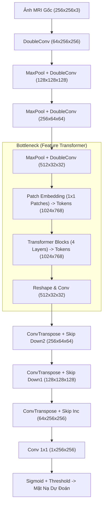

# Đánh Giá Kỹ Thuật Đồ Án: Phân Đoạn Khối U Não với U-Net và TransUNet

Chào bạn, tôi đã thực hiện rà soát toàn bộ cấu trúc thư mục, mã nguồn huấn luyện, kiến trúc mạng và tệp cấu hình của dự án **Unet_Transformer (Đề tài tốt nghiệp)**. 

Dưới đây là báo cáo đánh giá chi tiết, chỉ ra các ưu điểm, các lỗi kỹ thuật quan trọng và đề xuất cải tiến tối ưu nhất để đồ án đạt điểm tối đa khi bảo vệ trước Hội đồng.

---

## 📊 Sơ Đồ Kiến Trúc Hệ Thống (Mô Hình Đề Xuất TransUNet)

Dưới đây là luồng xử lý dữ liệu và cấu trúc ghép nối giữa **CNN (U-Net Encoder)** và **Vision Transformer (ViT)** trong mô hình TransUNet của bạn:



---

## 🌟 Điểm Mạnh của Dự Án Hiện Tại

1. **Tự Viết Code từ Đầu (From Scratch):** Khối `DoubleConv`, `PatchEmbedding`, `TransformerBlock` và toàn bộ khung của `TransUNet` được lập trình chi tiết bằng PyTorch mà không phụ thuộc vào các thư viện bên thứ ba chứa mô hình sẵn (như `segmentation_models_pytorch`). Điều này được đánh giá rất cao trong các đồ án tốt nghiệp.
2. **Kế Hoạch và Tiến Độ Rõ Ràng:** File [project_plan.md](file:///d:/ĐeTaiTotNghiep/project_plan.md) và [temp_docx_content.txt](file:///d:/ĐeTaiTotNghiep/temp_docx_content.txt) cho thấy bạn bám rất sát lộ trình, cấu trúc báo cáo đồ án chuẩn mực.
3. **Cấu Hình Tiện Lợi (Configs):** Có parser xử lý phân biệt thư mục chạy local và chạy trên Kaggle giúp việc huấn luyện linh hoạt.
4. **Đã Có Kết Quả Huấn Luyện:** File `unet_best_model.pth` và `transunet_best_model.pth` đã được lưu thành công kèm ảnh trực quan hóa [comparison_result.png](file:///d:/ĐeTaiTotNghiep/comparison_result.png).

---

## ⚠️ Các Lỗi Kỹ Thuật Nghiêm Trọng & Giải Pháp Cải Tiến

### 1. Rò Rỉ Dữ Liệu (Data Leakage) khi Chia Tập Train/Val (CỰC KỲ NGHIÊM TRỌNG)

> [!WARNING]
> **Lỗi lý thuyết y tế:** Dự án đang sử dụng hàm `random_split` trực tiếp trên danh sách tất cả các ảnh ở [train.py](file:///d:/ĐeTaiTotNghiep/train.py#L41).
> ```python
> train_data, val_data = random_split(dataset, [train_size, val_size])
> ```
> Vì tập dữ liệu MRI của mỗi bệnh nhân chứa rất nhiều lát cắt (slices) khác nhau, việc chia ngẫu nhiên từng ảnh sẽ làm cho **các lát cắt của cùng một bệnh nhân** vừa xuất hiện ở tập Train vừa xuất hiện ở tập Validation. Điều này khiến chỉ số Dice Score trên tập Validation cao ảo (overfitting nhưng không phát hiện được) và mô hình sẽ hoạt động kém khi gặp bệnh nhân mới hoàn toàn.

**👉 Giải pháp (Patient-level Split):** Chia tập Train/Val dựa trên danh sách các thư mục bệnh nhân (Patient ID) chứ không chia theo từng ảnh đơn lẻ. 
*Cách thực hiện trong code:*
Cập nhật [dataset.py](file:///d:/ĐeTaiTotNghiep/data/dataset.py) để có thể lọc theo danh sách bệnh nhân được chỉ định:
```python
# data/dataset.py
class BrainTumorDataset(Dataset):
    def __init__(self, dataset_dir, image_size=256, transform=None, patient_list=None):
        self.dataset_dir = dataset_dir
        self.image_size = image_size
        self.transform = transform
        self.image_paths = []
        self.mask_paths = []
        
        # Nếu truyền danh sách bệnh nhân cụ thể, chỉ load dữ liệu của họ
        if patient_list is not None:
            patients = patient_list
        else:
            patients = [d for d in os.listdir(dataset_dir) if os.path.isdir(os.path.join(dataset_dir, d))]
            
        for patient_dir in patients:
            patient_path = os.path.join(dataset_dir, patient_dir)
            if os.path.isdir(patient_path):
                masks = glob.glob(os.path.join(patient_path, '*_mask.tif'))
                for mask_path in masks:
                    img_path = mask_path.replace('_mask.tif', '.tif')
                    if os.path.exists(img_path):
                        self.image_paths.append(img_path)
                        self.mask_paths.append(mask_path)
```
Và trong [train.py](file:///d:/ĐeTaiTotNghiep/train.py):
```python
    # Lấy danh sách thư mục bệnh nhân
    all_patients = [d for d in os.listdir(dataset_path) if os.path.isdir(os.path.join(dataset_path, d))]
    
    # Chia bệnh nhân 80-20
    import random
    random.seed(42)
    random.shuffle(all_patients)
    
    if args.test_mode or (not is_kaggle and device.type == 'cpu'):
        train_patients = all_patients[:2]
        val_patients = all_patients[2:3]
    else:
        split_idx = int(0.8 * len(all_patients))
        train_patients = all_patients[:split_idx]
        val_patients = all_patients[split_idx:]
        
    train_dataset = BrainTumorDataset(dataset_path, patient_list=train_patients, transform=train_transform)
    val_dataset = BrainTumorDataset(dataset_path, patient_list=val_patients, transform=None)
```

---

### 2. Chưa Kích Hoạt Tăng Cường Dữ Liệu (Data Augmentation)

> [!NOTE]
> Dataset trong file [dataset.py](file:///d:/ĐeTaiTotNghiep/data/dataset.py#L49-L52) có sẵn logic biến đổi ảnh:
> ```python
> if self.transform is not None:
>     augmentations = self.transform(image=image, mask=mask)
> ```
> Tuy nhiên, trong [train.py](file:///d:/ĐeTaiTotNghiep/train.py#L27) tham số `transform` chưa được truyền vào Dataset khi huấn luyện thực tế. Điều này làm giảm đáng kể khả năng học tổng quát của mô hình.

**👉 Giải pháp:** Định nghĩa tập các phép Augmentations mạnh bằng thư viện `albumentations` trong [train.py](file:///d:/ĐeTaiTotNghiep/train.py) (chỉ áp dụng cho tập train, tập validation giữ nguyên ảnh gốc):
```python
import albumentations as A

train_transform = A.Compose([
    A.HorizontalFlip(p=0.5),
    A.VerticalFlip(p=0.5),
    A.RandomRotate90(p=0.5),
    A.ShiftScaleRotate(shift_limit=0.0625, scale_limit=0.1, rotate_limit=45, p=0.5),
    A.RandomBrightnessContrast(p=0.2),
])
```

---

### 3. Thiếu Bộ Điều Chỉnh Tốc Độ Học (Learning Rate Scheduler)

> [!TIP]
> Mô hình TransUNet có thành phần Transformer, cấu trúc này nhạy cảm với tốc độ học và dễ rơi vào điểm tối ưu cục bộ nếu lr không được giảm dần hợp lý. Việc giữ nguyên lr `1e-4` suốt 150 epoch là chưa tối ưu.

**👉 Giải pháp:** Thêm Scheduler `CosineAnnealingLR` trong [train.py](file:///d:/ĐeTaiTotNghiep/train.py) để tự động giảm tốc độ học theo đồ thị hình cos, giúp mô hình hội tụ sâu hơn và Dice Score tốt hơn:
```python
from torch.optim.lr_scheduler import CosineAnnealingLR

optimizer = optim.AdamW(model.parameters(), lr=args.lr)
scheduler = CosineAnnealingLR(optimizer, T_max=args.epochs)

# Cập nhật scheduler ở cuối mỗi epoch trong vòng lặp trainer
# scheduler.step()
```

---

### 4. Báo Cáo Thiếu Chỉ Số Đánh Giá Val IoU và Biểu Đồ Lịch Sử

Trong [trainer.py](file:///d:/ĐeTaiTotNghiep/trainer.py), bạn đã viết hàm tính IoU nhưng chỉ hiển thị và theo dõi `Val Dice` để lưu mô hình. Để phục vụ việc viết Chương 4 đồ án tốt nghiệp (Thực nghiệm & Đánh giá), việc ghi nhận và vẽ biểu đồ lịch sử Loss, Dice, IoU của cả 2 mô hình là bắt buộc.

**👉 Giải pháp:**
- Cập nhật [trainer.py](file:///d:/ĐeTaiTotNghiep/trainer.py) để tính toán, in thêm `Val IoU` và lưu lại lịch sử train/val loss và metrics ra một tệp JSON hoặc CSV.

---

## 🛠️ Đề Xuất Thực Hiện Giai Đoạn 7: Xây Dựng Ứng Dụng Web UI (Streamlit)

Đúng theo kế hoạch của bạn tại Giai đoạn 7, tôi đề xuất tạo một tệp **[app.py](file:///d:/ĐeTaiTotNghiep/app.py)** bằng thư viện `Streamlit` để tạo một giao diện Web trực quan, hiện đại. Dưới đây là phác thảo chi tiết ứng dụng web y tế:

### Tính Năng Giao Diện Web:
- Cho phép người dùng upload ảnh MRI sọ não (.png, .jpg, .tif).
- Chọn mô hình dự đoán (U-Net truyền thống hoặc TransUNet cải tiến).
- Trực quan hóa vùng u não bằng cách **phủ màu đỏ (Red Overlay)** trực tiếp lên ảnh MRI gốc.
- Thống kê tỷ lệ diện tích khối u chiếm dụng trên toàn bộ ảnh não.

### Mã Nguồn Gợi Ý Cho `app.py`:

```python
# app.py
import streamlit as st
import torch
import numpy as np
from PIL import Image
import cv2
import os

from networks.unet import UNet
from networks.transunet import TransUNet

st.set_page_config(page_title="Chẩn Đoán Khối U Não", layout="wide")

# Thiết kế giao diện tối hiện đại (Premium Dark Theme CSS)
st.markdown("""
    <style>
    .main { background-color: #0e1117; color: #ffffff; }
    h1 { color: #00e5ff; font-family: 'Outfit', sans-serif; text-align: center; font-weight: 700; }
    h3 { font-family: 'Outfit', sans-serif; color: #e0e0e0; }
    .stButton>button { background-color: #00e5ff; color: #0e1117; font-weight: bold; border-radius: 8px; border: none; }
    .stButton>button:hover { background-color: #00b8d4; color: #ffffff; }
    </style>
""", unsafe_allow_html=True)

st.title("🧠 Hệ Thống Phân Đoạn Khối U Não (LGG MRI Segmentation)")
st.write("<p style='text-align: center;'>Ứng dụng trí tuệ nhân tạo (U-Net & Vision Transformer) hỗ trợ khoanh vùng tổn thương u não từ ảnh chụp MRI</p>", unsafe_allow_html=True)
st.write("---")

# Cấu hình sidebar
st.sidebar.title("🛠️ Cấu hình mô hình")
model_type = st.sidebar.selectbox("Chọn mô hình dự đoán", ["U-Net", "TransUNet"])
threshold = st.sidebar.slider("Ngưỡng tin cậy phân đoạn (Threshold)", 0.1, 0.9, 0.5, 0.05)

device = torch.device('cuda' if torch.cuda.is_available() else 'cpu')

# Tải mô hình và lưu vào bộ nhớ cache để tăng tốc độ chạy
@st.cache_resource
def load_segmentation_model(model_name):
    if model_name == "U-Net":
        model = UNet(in_channels=3, out_channels=1)
        weight_path = "unet_best_model.pth"
    else:
        model = TransUNet(in_channels=3, out_channels=1, img_size=256)
        weight_path = "transunet_best_model.pth"
        
    if os.path.exists(weight_path):
        model.load_state_dict(torch.load(weight_path, map_location=device, weights_only=True))
        model.to(device)
        model.eval()
        return model, True
    return model, False

model, is_loaded = load_segmentation_model(model_type)

if not is_loaded:
    st.sidebar.warning(f"⚠️ Chưa tìm thấy file trọng số cho {model_type}. Vui lòng đặt file .pth tương ứng ở thư mục gốc.")
else:
    st.sidebar.success(f"✅ Đã tải trọng số {model_type} thành công.")

col1, col2 = st.columns([1, 1])

with col1:
    st.subheader("📁 1. Tải ảnh MRI")
    uploaded_file = st.file_uploader("Kéo thả hoặc chọn tệp tin (.png, .jpg, .tif)", type=["png", "jpg", "tif"])
    
    if uploaded_file is not None:
        image = Image.open(uploaded_file).convert("RGB")
        st.image(image, caption="Ảnh MRI chụp cắt lớp sọ não", use_container_width=True)

with col2:
    st.subheader("🎯 2. Kết quả phân đoạn u não")
    if uploaded_file is not None:
        if not is_loaded:
            st.error("Không thể suy luận do chưa tải được trọng số mô hình tương ứng.")
        else:
            with st.spinner("Đang chạy mô hình AI phân đoạn vùng u..."):
                # Tiền xử lý ảnh giống Dataset huấn luyện
                img_resized = image.resize((256, 256), Image.BILINEAR)
                img_np = np.array(img_resized) / 255.0
                img_tensor = torch.tensor(img_np, dtype=torch.float32).permute(2, 0, 1).unsqueeze(0).to(device)
                
                # Dự đoán
                with torch.no_grad():
                    pred = model(img_tensor)
                    pred = torch.sigmoid(pred).squeeze().cpu().numpy()
                
                # Áp dụng ngưỡng để ra mặt nạ nhị phân
                mask_pred = (pred > threshold).astype(np.uint8)
                
                # Resize mặt nạ về kích thước ảnh gốc ban đầu
                mask_orig_size = cv2.resize(mask_pred, (image.size[0], image.size[1]), interpolation=cv2.INTER_NEAREST)
                
                # Tạo lớp phủ màu đỏ lên vùng u
                original_np = np.array(image)
                overlay = original_np.copy()
                overlay[mask_orig_size == 1] = [255, 0, 0] # Đánh dấu màu đỏ
                
                # Trộn ảnh gốc và lớp phủ màu
                blended = cv2.addWeighted(original_np, 0.7, overlay, 0.3, 0)
                
                st.image(blended, caption=f"Vùng u não được mô hình {model_type} phát hiện (Màu Đỏ)", use_container_width=True)
                
                # Phân tích thống kê vùng tổn thương
                tumor_pixels = np.sum(mask_orig_size == 1)
                total_pixels = mask_orig_size.size
                tumor_ratio = (tumor_pixels / total_pixels) * 100
                
                st.info(f"📊 **Số liệu phân tích:**\n"
                        f"- Kích thước ảnh gốc: {image.size[0]}x{image.size[1]} pixels\n"
                        f"- Diện tích vùng u não: {tumor_pixels} pixels\n"
                        f"- Tỉ lệ bao phủ khối u: {tumor_ratio:.2f}% của lát cắt")
    else:
        st.info("Vui lòng tải ảnh chụp MRI lên để hệ thống tự động xử lý.")
```

---

## 📅 Kế Hoạch Tiếp Theo Đề Xuất

Để giúp bạn hoàn thiện đồ án này tốt nhất, tôi đề xuất các bước triển khai tiếp theo như sau:
1. **Sửa lỗi Data Leakage và Thêm Augmentation** trực tiếp vào file huấn luyện để chạy lại và lấy bảng số liệu thực chính xác cho báo cáo.
2. **Tạo tệp `app.py`** để bạn có thể chạy thử và trực quan hóa mô hình ngay trên máy của mình.
3. **Thêm cơ chế Early Stopping và Learning Rate Scheduler** để tối ưu hóa quá trình học tập trên Kaggle.

Bạn phản hồi xem chúng ta có nên bắt đầu thực hiện các bước chỉnh sửa code và tạo giao diện Web Streamlit này không nhé!
